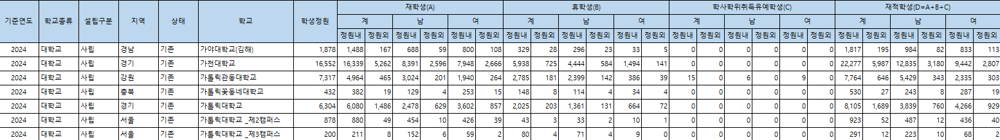

# 대학별 재학생수 수집 & 전처리 정리

## 원본 출처

대학알리미 - 재적학생현황 데이터

https://www.academyinfo.go.kr/uipnh/unt/unmcom/RdViewer.do



<br>

## 전처리
### `./Data/재적_학생_현황_(대학)_2024-12-04079849.csv`

지역: 서울 / 학교종류: 방통대, 사이버대 제외 => 필터링

재학생(계)-정원내 + 재학생(계)-정원외 => 총재학생수 컬럼 추가

위 조건 수행 후 결과

`기준연도,학교종류,설립구분,지역,상태,학교,학생정원,정원내,정원외,총재학생수`

<br>

### `enrollment_preprocessing.py`

```python
# str -> int
df['총재학생수'] = df['총재학생수'].str.replace(',', '').astype(int)

# 중복 대학명 확인
duplicate_schools = df['학교'].str.replace(r' _제\d+캠퍼스$', '', regex=True).duplicated(keep=False)

# 중복되지 않은 대학만 캠퍼스 suffix 제거
df.loc[~duplicate_schools, '학교'] = df.loc[~duplicate_schools, '학교'].str.replace(r' _제\d+캠퍼스', '', regex=True)

result_df = df[['학교', '총재학생수']]

# 결과 저장
result_df.to_csv('./UnivInfo/enrollment/university_enrollment.csv', index=False)
```

- 문자열 타입의 총재학생수를 Int형으로 변환
- 서울시 내에 여러 캠퍼스가 있는 경우 접미사 제거 처리하지 않음
- 필요한 컬럼인 학교, 총재학생수만 추출